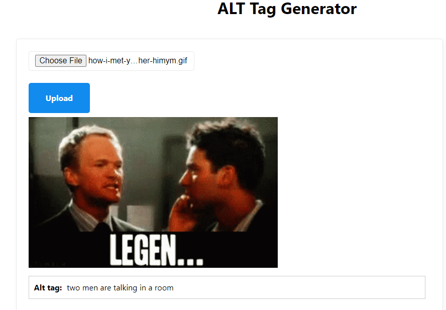

# ALTTagMLService

This is our standalone web ui to perform image to alt tag generation.\
We are using python's flask environment to host this website.

## Steps to run

### Step 1: Installing necessary dependencies
`pip install -r requirements.txt`

### Step 2:
`python app.py`

## Sample output

